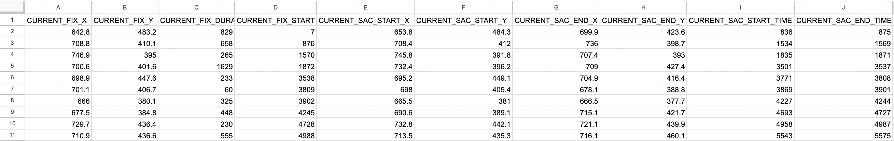

# Eye-Tracking-Heatmap

Python program to overlay heatmap of eye tracking data on a video.

Dependencies:
- numpy
- matplotlib
- tkinter
- cv2 (opencv)
- pillow

To run: 
1. From project directory, run main.py.
2. Use the tkinter GUI to import one or more csv data files and one mp4 video file. The input data must be of the format:
 
** Note that the headings DO matter **
4. Click 'Run'. The imported video will play as the program reads in the its individual frames. When the video playback window closes, you are free to exit the program.
5. The resulting video named 'output.mp4' will be located in the project directory.

